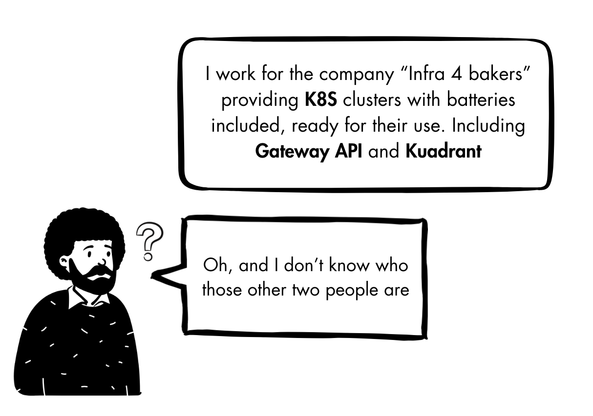

# Ian: Infrastructure Provider



### Create the cluster
```sh
kind create cluster --name=evil-genius-cupcakes
```

### Install cert-manager

```sh
helm repo add jetstack https://charts.jetstack.io --force-update
helm install cert-manager jetstack/cert-manager \
  --namespace cert-manager \
  --create-namespace \
  --set crds.enabled=true
```

### Install MetalLB

```sh
helm repo add metallb https://metallb.github.io/metallb --force-update
helm install metallb metallb/metallb \
  --namespace metallb-system \
  --create-namespace \
  --wait

kubectl -n metallb-system apply -f -<<EOF
apiVersion: metallb.io/v1beta1
kind: IPAddressPool
metadata:
  name: evil-genius-cupcakes
spec:
  addresses:
  - 10.89.0.0/28
---
apiVersion: metallb.io/v1beta1
kind: L2Advertisement
metadata:
  name: empty
EOF
```

### Install Envoy Gateway (gateway controller)

```sh
helm install eg oci://docker.io/envoyproxy/gateway-helm \
  --version v1.3.1\
  --namespace envoy-gateway-system \
  --create-namespace

kubectl get configmap -n envoy-gateway-system envoy-gateway-config \
  -o jsonpath='{.data.envoy-gateway\.yaml}' > /tmp/envoy-gateway.yaml
yq e '.extensionApis.enableEnvoyPatchPolicy = true' -i /tmp/envoy-gateway.yaml
kubectl create configmap -n envoy-gateway-system envoy-gateway-config \
  --from-file=envoy-gateway.yaml=/tmp/envoy-gateway.yaml -o yaml --dry-run=client | kubectl replace -f -
kubectl rollout restart deployment envoy-gateway -n envoy-gateway-system
rm -rf /tmp/envoy-gateway.yaml

kubectl create -f - <<EOF
apiVersion: gateway.networking.k8s.io/v1
kind: GatewayClass
metadata:
  name: eg
spec:
  controllerName: gateway.envoyproxy.io/gatewayclass-controller
EOF
```

### Install Kuadrant (policy controller)

```sh
helm repo add kuadrant https://kuadrant.io/helm-charts/ --force-update
helm install kuadrant-operator kuadrant/kuadrant-operator \
  --namespace kuadrant-system \
  --create-namespace \
  --wait

kubectl -n kuadrant-system patch deployment kuadrant-operator-controller-manager \
  --type='json' \
  -p='[{"op": "add", "path": "/spec/template/spec/containers/0/env/-", "value": {"name": "AUTH_SERVICE_TIMEOUT", "value": "5s"}}]'

kubectl create -n kuadrant-system -f - <<EOF
apiVersion: kuadrant.io/v1beta1
kind: Kuadrant
metadata:
  name: kuadrant
spec: {}
EOF
```

### Create an access for Chihiro

```sh
kubectl create serviceaccount chihiro -n kube-system
kubectl patch clusterrolebinding cluster-admin --type='json' -p='[{"op": "add", "path": "/subjects/-", "value": {"kind": "ServiceAccount", "name": "chihiro", "namespace": "kube-system"}}]'
```

```sh
CHIHIRO_TOKEN=$(kubectl create token chihiro -n kube-system --duration 8760h)
```
